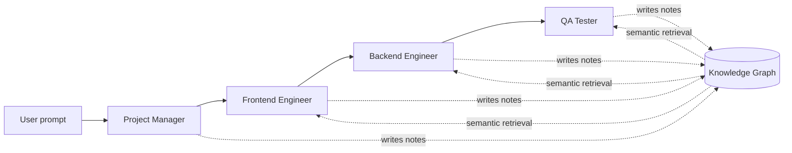
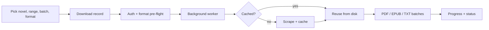

 

 

<table align="center">
<tr>
<td align="center"><b>Integrated M.Tech</b> Computational & Data Science VIT Bhopal</td>
<td align="center"><b>LLM Post-Training</b> Intern @ <a href="https://ethara.ai">Ethara.ai</a> (completed)</td>
<td align="center"><b>Published</b> Ternary Logic LFSR for image cryptography</td>
<td align="center"><b>Certified</b> Google IT Support Professional</td>
</tr>
</table>

---

## Scoreboard

<table align="center">
<tr>
<td align="center"><h3>500 / 500</h3>CartPole (PPO) perfect score</td>
<td align="center"><h3>~251</h3>LunarLander (PPO) solved at 200</td>
<td align="center"><h3>96.98%</h3>Lung histopathology CNN 0.9963 AUC</td>
<td align="center"><h3>7 agents</h3>RAG pipeline 5-provider LLM failover</td>
</tr>
</table>

---

## Flagship Projects

<table>
<tr>
<td width="50%" valign="top">

### [NoteMind](https://github.com/Ayush-1271/NoteMind)
**Graph memory for multi-agent AI**

Every agent framework gives each agent an isolated context window, so token cost explodes as swarms grow. NoteMind replaces that with a **persistent semantic knowledge graph**: agents write atomic Markdown notes, retrieve only the relevant slice, and you watch the graph grow live.

`Gemini 2.5` `FastAPI` `WebSockets` `ChromaDB` `MongoDB` `React Flow`

</td>
<td width="50%" valign="top">

### [RAG PDF Chat](https://github.com/Ayush-1271/rag-pdf-chat) · [Live demo](https://rag-pdf-chat-seven.vercel.app/)
**Chat with a PDF, with page-level citations**

A **7-agent answer pipeline** (extract → analyze → preprocess → optimize → synthesize → validate → assemble), a **FAISS index per session**, **SSE token streaming**, and **automatic failover** across OpenRouter, Groq, Gemini, Hugging Face and OpenAI.

`React` `TypeScript` `FastAPI` `LangChain` `FAISS`

</td>
</tr>
<tr>
<td width="50%" valign="top">

### [MarketLens](https://github.com/Ayush-1271/MarketLens)
**Market analysis that admits when it doesn't know**

Not a trading bot. A **CNN + Transformer** model outputs **P10 / P50 / P90 bands**, classifies volatility regimes, **rejects unreliable assets**, and returns `NaN` instead of a fabricated metric. Stress-tested on the COVID-19 crash.

`CNN + Transformer` `Probabilistic forecasting` `Streamlit`

</td>
<td width="50%" valign="top">

### Novel Vault · *private repository*
**My passion project. Built because I wanted it to exist.**

A modular web-novel **aggregation, caching, download and document-generation platform**: plugin-based source adapters and export formats, concurrent cross-source search, a resumable background pipeline, browser-driven login, and PDF / EPUB / TXT output.

`FastAPI` `SQLAlchemy` `Selenium` `BeautifulSoup` `fpdf2` `EbookLib` `pytest`

</td>
</tr>
</table>

<b>Under the hood: how NoteMind agents share memory</b>

 

<b>Under the hood: how Novel Vault downloads a book</b>

 

| Capability | Detail |
|---|---|
| Plugin architecture | `BaseSource` for sites and `OutputFormat` for exports; plugins self-register and are auto-discovered |
| Source adapters | FanMTL, NovelFire (Requests + BeautifulSoup) · TomatoMTL, WTR-Lab (Selenium) |
| Search | Concurrent across all adapters, normalized, exact-title filtered |
| Download lifecycle | pending → running → completed / failed / cancelled, with retry, resume and cancel |
| Reliability | HTTP backoff, block detection, fresh-session Selenium retries, orphaned-job recovery, disk-backed chapter cache |

---

## How I Work

| | |
|---|---|
| **Honest evaluation** | MarketLens returns `NaN` instead of a made-up score. MangaLens documents exactly what it can't do. I'd rather show a limit than hide it. |
| **Memory beats brute force** | NoteMind, RAG PDF Chat and Novel Vault all avoid redoing work: retrieve the relevant slice, cache what's already done. |
| **Ship it so people can touch it** | PPO agents run live in a browser demo, a RAG app is deployed, and models are exported to lightweight NumPy so demos stay fast on free tiers. |

---

## The Lab

<b>More AI & LLM projects</b>

 

| Project | What it does |
|---|---|
| **[MangaLens](https://github.com/Ayush-1271/MangaLens)** | Chrome extension. **Gemini Vision** finds text inside manga panels, translates it into 18 languages, and redraws it in place, with a **translation memory** to keep character names consistent. |
| **[AI Resume Analyzer](https://github.com/Ayush-1271/AI_Resume_Analyzer)** | **3-signal hybrid** match score (TF-IDF + MiniLM embeddings + skill overlap), skill-gap analysis against a 10k+ vocabulary, job ranking, and OpenVINO inference (no CUDA needed). |
| **[Social Media Sentiment Analysis](https://github.com/Ayush-1271/Social-Media-Sentiment-Analysis)** | NLP + classical ML classifiers on messy social text. |

<b>Reinforcement learning</b>

 

| Project | Result |
|---|---|
| **[CartPole PPO](https://github.com/Ayush-1271/cartpole-ppo-rl)** | Perfect **500/500** every evaluation episode (random agent: ~27) |
| **[LunarLander PPO](https://github.com/Ayush-1271/lunarlander-ppo-rl)** | Mean **~251**, solved threshold 200 (random agent: ~-178), ~1.11M timesteps |
| **[RL Demo Web](https://github.com/Ayush-1271/rl-demo-web)** | Flask app that runs live episodes of both agents. Policies are exported to **pure NumPy** and verified for **100% action agreement** with Stable-Baselines3. |

<b>Vision & classical ML</b>

 

| Project | Result |
|---|---|
| **[Cancer Detection CNN](https://github.com/Ayush-1271/cancer-detection-cnn)** | **96.98%** accuracy · **0.9963** AUC on 15,000 lung histopathology images |
| **[Face Recognition CNN](https://github.com/Ayush-1271/face-recognition-cnn)** | **86.23%** validation accuracy, 15 classes on LFW |
| **[Movie Recommender](https://github.com/Ayush-1271/Movie-Recommendation-System)** | Collaborative filtering with **Truncated SVD from scratch** on a 98.3%-empty matrix |
| **[TeachAI](https://github.com/Ayush-1271/TeachAI)** | Anti-proxy attendance: **face recognition + GPS validation** |
| **[Diabetes Progression API](https://github.com/Ayush-1271/diabetes-risk-predictor-docker)** | Flask ML API deployed with **Docker**, using only inputs a person can actually know |

<b>Full-stack & tooling experiments</b>

 

| Project | What it does |
|---|---|
| **[ChemicalEquipmentVisualizer](https://github.com/Ayush-1271/ChemicalEquipmentVisualizer)** | One **Django REST API** powering both a **React web app** and a **PyQt5 desktop app** |
| **[Bin2Book Novel Scraper](https://github.com/Ayush-1271/Bin2Book-Novel-Scraper)** | Multi-threaded scraper with a GUI that turns web novels into structured PDFs |
| **[waipy (fork)](https://github.com/Ayush-1271/waipy)** | Wavelet analysis: CWT, significance tests, cross-wavelet analysis |

> **Research:** [Ternary Logic LFSR for cryptographic S-box design](https://iads.site/a-new-approach-for-image-security-enhancement-using-ternary-logic-linear-feedback-shift-register-for-cryptographic-applications/), evaluated with NPCR, UACI and entropy analysis.

---

## Toolbox

 

 

 

---

## Off the Clock

- Competitive programming: [Codeforces](https://codeforces.com/profile/Ayush_Ranjan12) · 300+ problems solved on LeetCode
- Web novels and manga are the reason **Novel Vault** and **MangaLens** exist
- Cryptography, from a published paper on ternary-logic LFSRs

 

 

*Open to ML/NLP internships, research collaborations, and interesting hard problems.*

**[ayushranjan1271@gmail.com](mailto:ayushranjan1271@gmail.com)**

