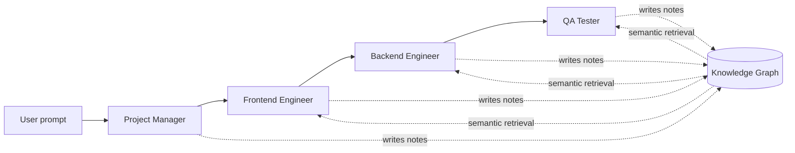
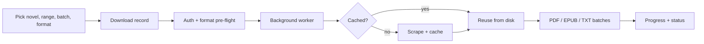

---

### 🧠 Agents & LLM Systems

| | |
|---|---|
| **[🧠 NoteMind](https://github.com/Ayush-1271/NoteMind)** — `Multi-Agent AI · Graph Memory` LangChain, AutoGen and CrewAI agents each live in an isolated context window, so token costs explode as swarms grow. NoteMind gives a 4-agent swarm (PM → Frontend → Backend → QA, **Gemini 2.5**) a **persistent semantic knowledge graph** instead. Agents write atomic Markdown notes, indexed in **ChromaDB + MongoDB**, and retrieve only the relevant slice. Live graph visualization in **React Flow** over **FastAPI WebSockets**. | **[📄 RAG PDF Chat](https://github.com/Ayush-1271/rag-pdf-chat)** — `Full-Stack RAG` · [**Live demo**](https://rag-pdf-chat-seven.vercel.app/) Ask a PDF questions and get answers grounded in the document with **page-level citations**. A **7-agent pipeline** (extract → analyze → preprocess → optimize → synthesize → validate → assemble), **FAISS** per-session indexes, **SSE token streaming**, and **automatic failover** across OpenRouter, Groq, Gemini, Hugging Face and OpenAI. React + TypeScript + FastAPI + LangChain. |
| **[🔍 MangaLens](https://github.com/Ayush-1271/MangaLens)** — `Multimodal · Chrome Extension` Google Translate skips text inside images, and the story in manga lives in speech bubbles. MangaLens uses **Gemini Vision** to detect text in panels, translate it into 18 languages, and **redraw it in place**. It keeps a **translation memory** so character names stay consistent across pages. The README lists its limits honestly, too. | **[📋 AI Resume Analyzer](https://github.com/Ayush-1271/AI_Resume_Analyzer)** — `NLP` Scores a resume against a job description with a **3-signal hybrid** (TF-IDF + `all-MiniLM-L6-v2` embeddings + skill overlap), finds missing skills against a 10k+ skill vocabulary, ranks jobs, and runs on **OpenVINO** so no CUDA is needed. Streamlit UI included. |

---

### 🎯 Reasoning Under Uncertainty & Reinforcement Learning

| | |
|---|---|
| **[📈 MarketLens](https://github.com/Ayush-1271/MarketLens)** — `Probabilistic ML · RAPID framework` **Not** a trading bot. A regime-aware system that outputs **P10 / P50 / P90 bands** instead of point predictions, classifies volatility regimes with a **CNN + Transformer** model, **rejects assets with unreliable data**, and returns `NaN` rather than a fabricated metric. Stress-tested on the COVID-19 crash. Streamlit dashboard included. | **[🕹️ PPO Agents + Live Demo](https://github.com/Ayush-1271/rl-demo-web)** — `Reinforcement Learning` **[CartPole](https://github.com/Ayush-1271/cartpole-ppo-rl)**: perfect **500/500**. **[LunarLander](https://github.com/Ayush-1271/lunarlander-ppo-rl)**: mean **~251** (solved is 200; a random agent scores about -178). The trained policies are exported to **pure NumPy weights** and verified for 100% action agreement with Stable-Baselines3, so the **[Flask web demo](https://github.com/Ayush-1271/rl-demo-web)** runs live episodes without PyTorch. |

> 🔐 **[Published research →](https://iads.site/a-new-approach-for-image-security-enhancement-using-ternary-logic-linear-feedback-shift-register-for-cryptographic-applications/)** Ternary Logic LFSR for cryptographic S-box design in image security, evaluated with NPCR, UACI and entropy analysis.

---

### 👁️ Vision & Classical ML (built from the math up)

| Project | What it does | Result |
|---|---|---|
| **[🫁 Cancer Detection CNN](https://github.com/Ayush-1271/cancer-detection-cnn)** | 5-block deep CNN classifying lung histopathology (adenocarcinoma, squamous cell, normal) on 15,000 images | **96.98%** accuracy · **0.9963** AUC |
| **[🙂 Face Recognition CNN](https://github.com/Ayush-1271/face-recognition-cnn)** | 15-class face recognition on LFW with a custom deep CNN | **86.23%** val accuracy |
| **[🎬 Movie Recommender](https://github.com/Ayush-1271/Movie-Recommendation-System)** | Collaborative filtering with **Truncated SVD implemented from scratch** (pandas, NumPy, SciPy; no recsys libraries) on MovieLens, a matrix that is 98.3% empty | Top-5 picks per user |
| **[🎓 TeachAI](https://github.com/Ayush-1271/TeachAI)** | Anti-proxy attendance using **face recognition + GPS validation** | Built for real classrooms |

---

### ⭐ Passion Project: Novel Vault

> *Not for a resume, not for a class. I built it because I wanted it to exist.*

**A modular web-novel aggregation, caching, download and document-generation platform.** Search several novel sites at once, cache chapters on disk, download in the background, survive crashes, and export clean **PDF / EPUB / TXT** books.

| | |
|---|---|
| **🧩 Plugin architecture** | `BaseSource` for sites, `OutputFormat` for exports. Plugins self-register via decorators and are auto-discovered, so new sites or formats never touch the core workflow. |
| **🌐 4 source adapters** | FanMTL, NovelFire (Requests + BeautifulSoup) · TomatoMTL, WTR-Lab (Selenium automation). |
| **🔎 Concurrent cross-source search** | Dispatched to every adapter in parallel, normalized, exact-title filtered. |
| **⚙️ Resumable pipeline** | `pending → running → completed / failed / cancelled`. Cancel, retry, resume. Cached chapters are never fetched twice. |
| **🔐 Browser-driven login** | Sign in via a real Chrome window; cookies are stored, validated and expiry-checked before each job. |
| **🛡️ Reliability** | HTTP retry/backoff, block detection, fresh-session Selenium retries, orphaned-job recovery after restarts, graceful browser cleanup. |
| **🧪 Tested** | Unit, integration and contract tests across adapters, outputs, lifecycle, APIs and search. |

`Python` `FastAPI` `SQLAlchemy 2.0` `SQLite` `Selenium` `BeautifulSoup4` `Jinja2` `Vanilla JS` `fpdf2` `EbookLib` `pytest`

🔒 **Private repository**

---

### 🔭 More Explorations

| Repo | What I was curious about |
|---|---|
| **[⚗️ ChemicalEquipmentVisualizer](https://github.com/Ayush-1271/ChemicalEquipmentVisualizer)** | Can one **Django REST API** be the single source of truth for a **React web app and a PyQt5 desktop app** at once? |
| **[🩺 Diabetes Progression API](https://github.com/Ayush-1271/diabetes-risk-predictor-docker)** | A Flask ML API shipped in **Docker**, using only the 5 inputs a person could actually know from a checkup. |
| **[💬 Social Media Sentiment Analysis](https://github.com/Ayush-1271/Social-Media-Sentiment-Analysis)** | How far do classic NLP + ML classifiers go on messy social text? |
| **[📚 Bin2Book Novel Scraper](https://github.com/Ayush-1271/Bin2Book-Novel-Scraper)** | A multi-threaded scraper with a GUI that turns web novels into structured PDFs. |
| **[🌊 waipy (fork)](https://github.com/Ayush-1271/waipy)** | Wavelet analysis: continuous wavelet transform, significance tests, cross-wavelet analysis. |

---

### 🛠️ Stack

**Languages**

**AI / ML**

**Backend, Data & Automation**

**Frontend & Tools**

---

### 🎮 Side Quests

- ⚔️ Competitive programming on [Codeforces](https://codeforces.com/profile/Ayush_Ranjan12) · 300+ problems solved on LeetCode
- 📖 Web novels and manga are why **Novel Vault** and **MangaLens** exist
- 🔐 Cryptography, from a published paper on ternary-logic LFSRs

---

### 📊 Stats

---

*Open to ML/NLP internships, research collaborations, and interesting hard problems.*

**[📬 ayushranjan1271@gmail.com](mailto:ayushranjan1271@gmail.com)**

